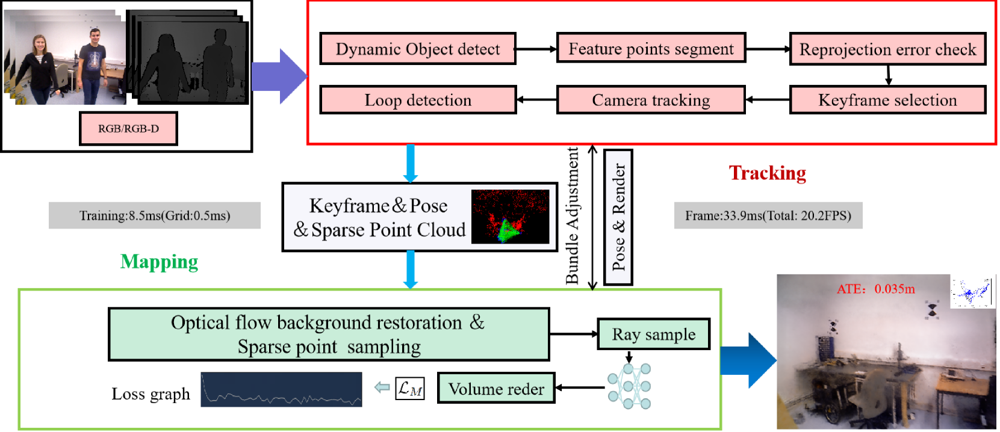

<p align="center">
   <h1 align="center">DDN-SLAM: Real-time Dense Dynamic Neural Implicit SLAM</h1>
 </p>
 
 <p align="center">
   <a href="">
     
   </a>
 </p>
 
 # Introduction
 
 The paper is available in https://doi.org/10.1109/LRA.2025.3546130
 
 DDN-SLAM is implemented with three open source projects
 
 - [Orbeez-SLAM](https://github.com/MarvinChung/Orbeez-SLAM) (GPLv3 license)
 - [ORB-SLAM2](https://github.com/raulmur/ORB_SLAM2) (GPLv3 license)
 - [instant-ngp](https://github.com/NVlabs/instant-ngp) (Nvidia Source Code License-NC)
 
 ## License
This repo is GPLv3 Licensed.
 
 ## How to build
 1. Install [yolo_ros](https://github.com/jianhengLiu/yolo_ros/tree/tensorrt)
 2. Please refer to [BUILD.md](https://github.com/MarvinChung/Orbeez-SLAM/blob/main//BUILD.md)
 
 ## RUN on TUM
 Please refer to [TUM.md](https://github.com/MarvinChung/Orbeez-SLAM/blob/main//TUM.md)
 
 ## RUN on Replica
 Please refer to [Replica.md](https://github.com/MarvinChung/Orbeez-SLAM/blob/main//Replica.md)
 
 ## RUN on ScanNet
 Please refer to [ScanNet.md](https://github.com/MarvinChung/Orbeez-SLAM/blob/main//ScanNet.md)
 
 ## RUN on a custom dataset
 Please refer to [Custom.md](https://github.com/MarvinChung/Orbeez-SLAM/blob/main//Custom.md)
 
 ## Evaluation
 Please refer to [Eval.md](https://github.com/MarvinChung/Orbeez-SLAM/blob/main//Eval.md)
 
 ## Acknowledgments
 This work has been possible thanks to the open-source code from [Orbeez-SLAM](https://github.com/MarvinChung/Orbeez-SLAM),[ORB-SLAM2](https://github.com/raulmur/ORB_SLAM2) and [instant-ngp](https://github.com/NVlabs/instant-ngp), as well as the open-source datasets [Replica](https://github.com/facebookresearch/Replica-Dataset) and [TUM-dataset](https://vision.in.tum.de/data/datasets/rgbd-dataset/download).


## Citation
If you find our work useful, please kindly cite us:

```bibtex
@ARTICLE{10904342,
  author={Li, Mingrui and Guo, Zhetao and Deng, Tianchen and Zhou, Yiming and Ren, Yuxiang and Wang, Hongyu},
  journal={IEEE Robotics and Automation Letters}, 
  title={DDN-SLAM: Real Time Dense Dynamic Neural Implicit SLAM}, 
  year={2025},
  volume={10},
  number={5},
  pages={4300-4307},
  keywords={Simultaneous localization and mapping;Semantics;Rendering (computer graphics);Neural radiance field;Feature extraction;Dynamics;Real-time systems;Optical flow;Accuracy;Interference;Dense visual SLAM;dynamic SLAM;neural implicit mapping},
  doi={10.1109/LRA.2025.3546130}}
```
